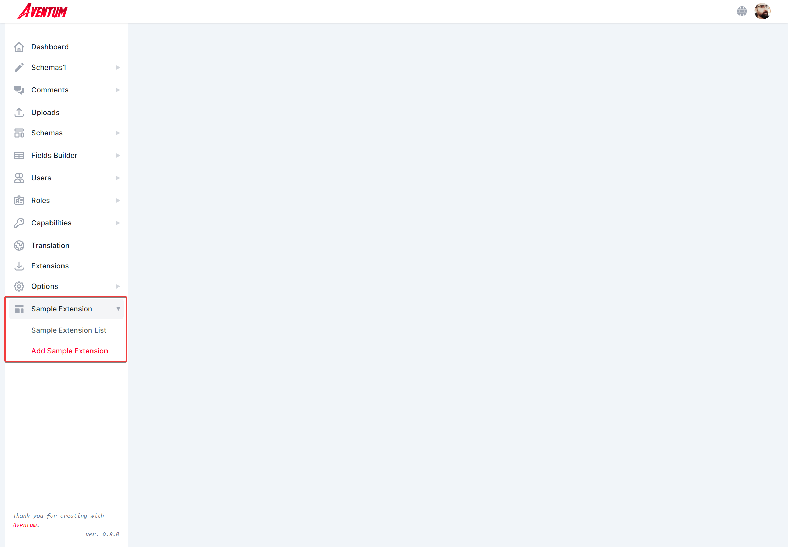
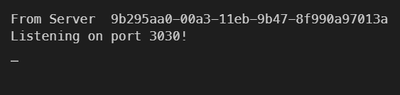

Aventum separated into two apps, a client-side app running in the browser which is the `dashboard`, it is a react app bootstrapped using Create React App, and a `server` app created using Express, you can create extensions for the backend(the express server) and the frontend(the dashboard) app.

## Clint Side/Dashboard Extension

> Extension source code available here https://github.com/TryAventum/sample-dashboard-extension

> Extension final build available here https://github.com/TryAventum/sample-dashboard-extension-final-build

> Please notice that if you want to create a zip file from https://github.com/TryAventum/sample-dashboard-extension-final-build or after running `npm run build` in https://github.com/TryAventum/sample-dashboard-extension and taking the `sample-dashboard-extension` folder, the `sample-dashboard-extension` folder must be inside `@aventum` folder and you must create a zip from `@aventum` folder, like [Sample Dashboard Extension Archive](./@aventum.zip) because the extension name is `@aventum/sample-dashboard-extension` in `sample-dashboard-extension/package.json` file.

We will build an extension that adds an entry with tow sub-items to the sidebar.



Even if our extension is really simple we are going to show you how to create your extension using webpack, create a folder, and run `npm init -y` within it.

Install the following development dependencies that will be used to bundle our extension:

```shell
npm install -D @babel/core@^7.5.5 @babel/preset-env@^7.5.5 @babel/preset-react@^7.0.0 babel-core@^6.26.3 babel-loader@^8.0.6 babel-preset-env@^1.7.0 babel-preset-react@^6.24.1 webpack@^4.36.1 webpack-cli@^3.3.6
```

Next, install our extension dependencies

```shell
npm install react@^16.8.6 react-dom@^16.8.6 react-router-dom@^5.0.1 semantic-ui-react@^0.87.3
```

Replace the `scripts` section of `package.json` file with:

```json
  "scripts": {
    "build": "webpack"
  },
```

Next, create `src` folder with `index.js` file within it and `sample-dashboard-extension` with `package.json` file within it.

In the `sample-dashboard-extension/package.json` put the following:

```json
{
  "name": "sample-dashboard-extension",
  "version": "1.0.0",
  "description": "Example of Aventum dashboard extension.",
  "main": "index.js",
  "author": {
    "name": "YOUR NAME",
    "email": "YOUR_EMAIL",
    "url": "YOUR WEBSITE"
  },
  "repository": {
    "type": "git",
    "url": "https://github.com/YOUR_USER_NAME/YOUR_REPO"
  },
  "license": "MIT",
  "aventum": {
    "target": "dashboard"
  },
  "keywords": ["aventum", "aventum-extension", "aventum-dashboard-extension"]
}
```

The most important key in `sample-dashboard-extension/package.json` is `aventum`, we specified that this extension is a dashboard extension by using `"target": "dashboard"`.

Next create `webpack.config.js` file with the following:

```js
const path = require("path")
const webpack = require("webpack")
const version =
  process.env.VERSION ||
  require("./sample-dashboard-extension/package.json").version

const banner =
  "Aventum Sample Dashboard Extension v" +
  version +
  "\n" +
  "(c) " +
  new Date().getFullYear() +
  " YOUR_NAME\n" +
  "Released under the MIT License."

module.exports = {
  entry: "./src/index.js",
  mode: "production",
  output: {
    path: path.resolve(__dirname, "sample-dashboard-extension"),
    filename: "index.js",
    library: "AventumSampleDashboardExtension",
    libraryTarget: "umd",
  },
  externals: {
    react: {
      commonjs: "react",
      commonjs2: "react",
      amd: "react",
      root: "React",
    },
    "semantic-ui-react": {
      commonjs2: "semantic-ui-react",
      commonjs: "semantic-ui-react",
      amd: "semantic-ui-react",
      root: ["aventum", "ui"],
    },
    "react-router-dom": {
      commonjs: "react-router-dom",
      commonjs2: "react-router-dom",
      amd: "react-router-dom",
      root: ["aventum", "router"],
    },
  },
  module: {
    rules: [
      {
        test: /\.m?js$/,
        exclude: /(node_modules|bower_components)/,
        use: {
          loader: "babel-loader",
          options: {
            presets: ["@babel/env", "@babel/react"],
          },
        },
      },
    ],
  },
  plugins: [
    new webpack.BannerPlugin({
      banner,
    }),
  ],
}
```

It is a webpack stuff so we will not discuss it here, however, we simply will take our source code from `src/index.js` compile it and put the output in the `sample-dashboard-extension/index.js` file.

In `src/index.js` put the following:

```js
aventum.hooks.addFilter(
  "SideBarMenu",
  "Aventum/AventumSampleDashboardExtension/addMenuItems",
  (menu, $this) => {
    menu.push({
      icon:
        '<svg fill="currentColor" viewBox="0 0 20 20"><path d="M3 4a1 1 0 011-1h12a1 1 0 011 1v2a1 1 0 01-1 1H4a1 1 0 01-1-1V4zM3 10a1 1 0 011-1h6a1 1 0 011 1v6a1 1 0 01-1 1H4a1 1 0 01-1-1v-6zM14 9a1 1 0 00-1 1v6a1 1 0 001 1h2a1 1 0 001-1v-6a1 1 0 00-1-1h-2z"></path></svg>',
      title: "Sample Extension",
      items: [
        {
          name: "sampleExtensionList",
          title: "Sample Extension List",
          link: `/sample-extension/list`,
        },
        {
          name: "newSampleExtension",
          title: "Add Sample Extension",
          link: `/sample-extension/new`,
        },
      ],
    })

    return menu
  }
)
```

We use the `SideBarMenu` filter to modify the sidebar menu array and push a new item to it, then we return it.

Finally, run `npm run build`, your extension is ready now, you can now create zip file from the `sample-dashboard-extension` folder and upload it to Aventum.

## Server Extension

> Extension source code available here https://github.com/TryAventum/sample-server-extension

Our extension will simply print `From Server ${uuid}` to the server console.



Create `sample-server-extension` folder for your extension and run `npm init -y` within it.

Install our dependency:

```shell
npm install uuid@^3.3.2
```

Add `aventum` key to the package.json file as follows:

```json
"aventum": {
  "target": "server"
}
```

Your `package.json` file should look something like:

```json
{
  "name": "sample-server-extension",
  "version": "1.0.0",
  "description": "",
  "main": "index.js",
  "scripts": {
    "test": "echo \"Error: no test specified\" && exit 1"
  },
  "keywords": [],
  "author": "",
  "aventum": {
    "target": "server"
  },
  "license": "ISC",
  "dependencies": {
    "uuid": "^3.3.2"
  }
}
```

Create `index.js` with the following:

```js
const uuidv1 = require("uuid/v1")

console.log("From Server ", uuidv1())
```

Your extension is ready now, you can now create a zip file from the `sample-server-extension` folder and upload it to Aventum.
