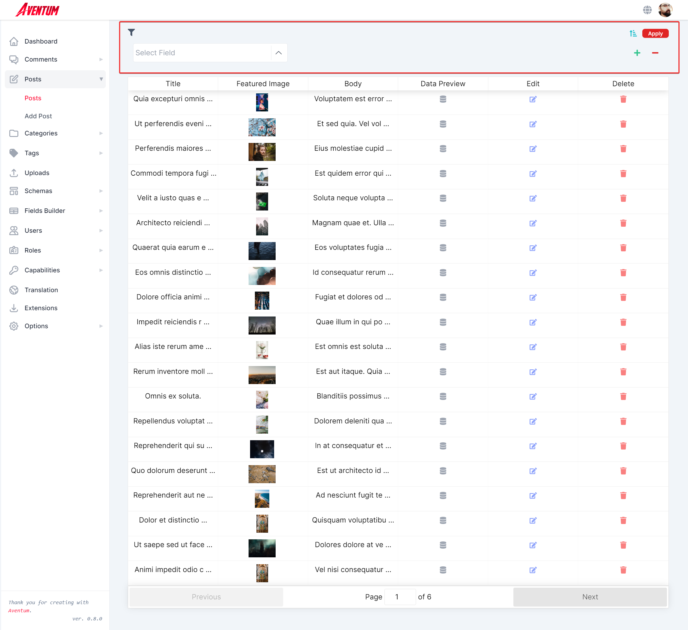
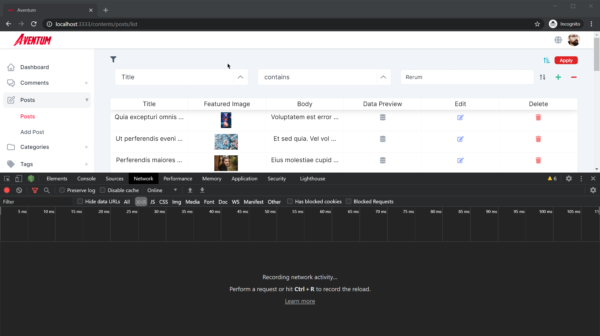

Aventum allows you to query your contents, uploads, etc. even if your query was complex and contains relations using a very simple method, also the query process is database agnostic so you can use the same query no matter if you are using MongoDB or PostgreSQL, in most cases Aventum query will be more than sufficient.

Aventum query supports `where`, `whereIn`, `whereNotIn`, `whereNot`, `like`, `notLike`, `sortBy`, and `sortOrder`.

## How to query your content from the frontend?

Creating a query is very simple here is a simple example:

```js
let query = { where: { post: 15 } }

const response = await fetch(
  `http://localhost:3030/schemaPluralName?query=${encodeURIComponent(
    JSON.stringify(query)
  )}&page=1`
)
```

In the previous example, we want all the items of `schemaPluralName` content where the `post` field equal to 15.

Here is a moe complex one:

```js
let query = {
  where: [
    {
      repDate: "2020-09-02T00:00:00+03:00",
    },
    {
      repTime: "18:30:00",
    },
    {
      repDateTime: "2020-09-02T21:30:00+03:00",
    },
    {
      decimal: "1.1",
    },
    {
      bigInt: "100",
    },
    {
      relation: 96,
    },
    {
      select: "w",
    },
    {
      file: 84,
    },
  ],
  whereIn: [],
  whereNotIn: [
    {
      column: "repDecimal",
      values: ["1.2"],
    },
    {
      column: "repBigInt",
      values: ["200"],
    },
    {
      column: "repRelation",
      values: [97, 90, 84],
    },
    {
      column: "repSelect",
      values: ["1", "3"],
    },
    {
      column: "files",
      values: [77, 72],
    },
  ],
  whereNot: [
    {
      column: "date",
      values: "2020-09-11T00:00:00+03:00",
    },
    {
      column: "time",
      values: "21:45:00",
    },
    {
      column: "dateTime",
      values: "2020-09-22T21:45:00+03:00",
    },
    {
      column: "bool",
      values: true,
    },
  ],
  like: [
    {
      column: "string",
      value: "wow",
    },
    {
      column: "wysiwyg",
      value: "alpha",
    },
    {
      column: "repTextarea",
      value: "text",
    },
  ],
  notLike: [
    {
      column: "repString",
      value: "lor",
    },
    {
      column: "repWysiwyg",
      value: "beta",
    },
  ],
  sortBy: "id",
  sortOrder: "DESC",
}

const response = await fetch(
  `http://localhost:3030/schemaPluralName?query=${encodeURIComponent(
    JSON.stringify(query)
  )}&page=1`
)
```

_Where the key or the column is the field name._

It is a very simple way to build your query each of `where`, `whereIn`, `whereNotIn`, `whereNot`, `like`, `notLike` can take either object or array, the object(s) that `where` can take consist of key-value pairs while `whereIn`, `whereNotIn`, `whereNot` takes object(s) consist of `column` which is the field name and `values`.

`like`, `notLike` takes object(s) consist of `column` & `value`.

We believe this will cover most cases but what if you want to build a special query, for a specific route? don't worry you can do whatever you want with Aventum using [Aventum plugins](../../api/).

> You can take a look at the filter feature that available on the content list pages like the post list page from the [tutorials](../../../tutorial/blog/create-content-entries/):
> 
> This filter simply builds a query dynamically then when you click on **Apply** a request made to the server with this query.
> 
> If you want to take a look at the filter code then you can find it [here](https://github.com/TryAventum/dashboard/blob/main/src/components/DynamicContentList/Filter/DynamicContentListFilter.js).
