## Application Settings

Navigate to [http://localhost:3333/options/general](http://localhost:3333/options/general), [http://localhost:3333/options/email](http://localhost:3333/options/email), [http://localhost:3333/options/login-providers](http://localhost:3333/options/login-providers), and [http://localhost:3333/options/cache](http://localhost:3333/options/cache) and make sure you have the correct settings there.

## Uploading Some Files

If you are going to use images/files then you can upload them upfront by navigating to [http://localhost:3333/uploads](http://localhost:3333/uploads) and upload your files!

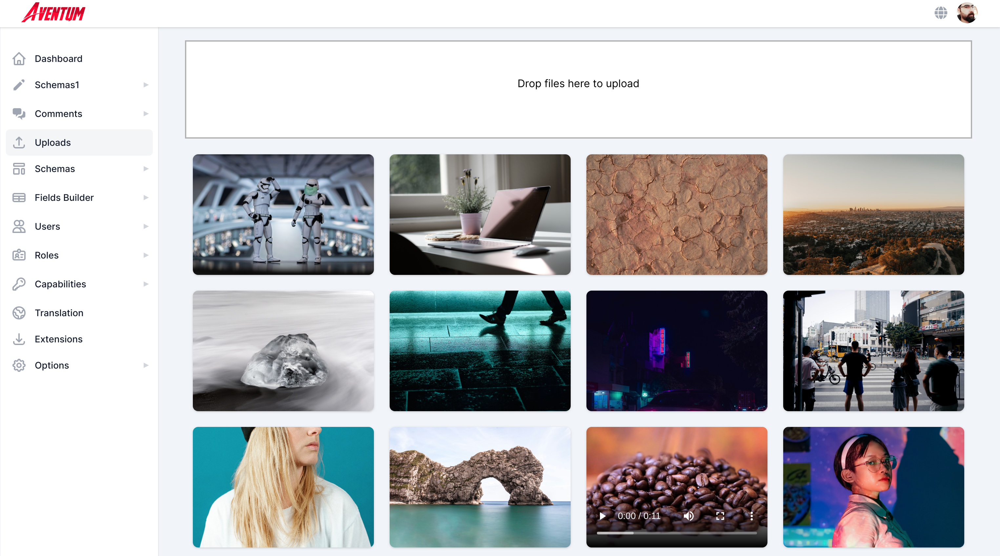

## Create Post Schema

For every content you want to create you must create a schema for it first, we will create a simple post schema type that just contains title, featured image, and body.

First, navigate to [http://localhost:3333/schemas/new](http://localhost:3333/schemas/new) to create the post schema.

In the schema title block:

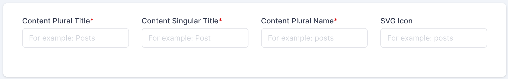

We will use `Posts` in _Content Plural Title_ and `Post` in _Content Singular Title_ and `posts` in _Content Plural Name_ which will be used internally and as a database table/collection name and as API endpoint. In _SVG Icon_ we will put the pencil-alt icon from [Heroicons](https://github.com/tailwindlabs/heroicons):

```html
<svg
  xmlns="http://www.w3.org/2000/svg"
  fill="none"
  viewBox="0 0 24 24"
  stroke="currentColor"
>
  <path
    stroke-linecap="round"
    stroke-linejoin="round"
    stroke-width="2"
    d="M11 5H6a2 2 0 00-2 2v11a2 2 0 002 2h11a2 2 0 002-2v-5m-1.414-9.414a2 2 0 112.828 2.828L11.828 15H9v-2.828l8.586-8.586z"
  />
</svg>
```

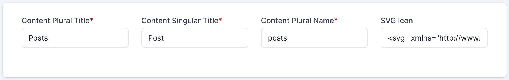

### Set Access Control List(ACL) Restrictions

You can set the ACL restrictions for this content in the ACL section of the schema, check the _Restrict_ option and select `Have Any Role` in the condition type dropdown, and select `author` and `super` roles in the condition value dropdown for the _CREATE_, _UPDATE_, and _DELETE_ tabs of the _Access Control List_ section, this will restrict the _CREATE_, _UPDATE_, and _DELETE_ operations for the users that have `author` or `super` roles.

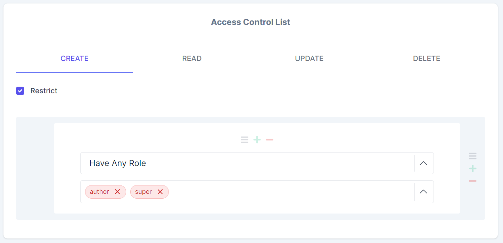
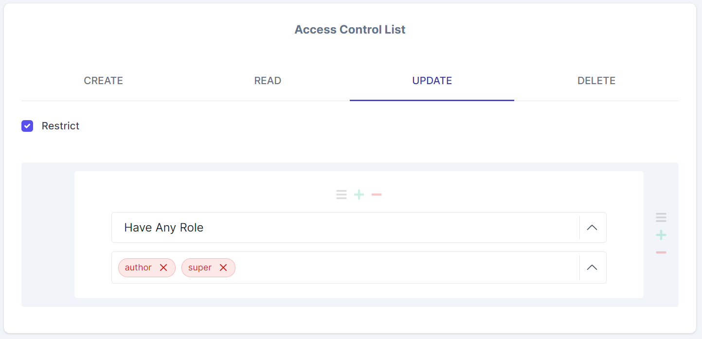
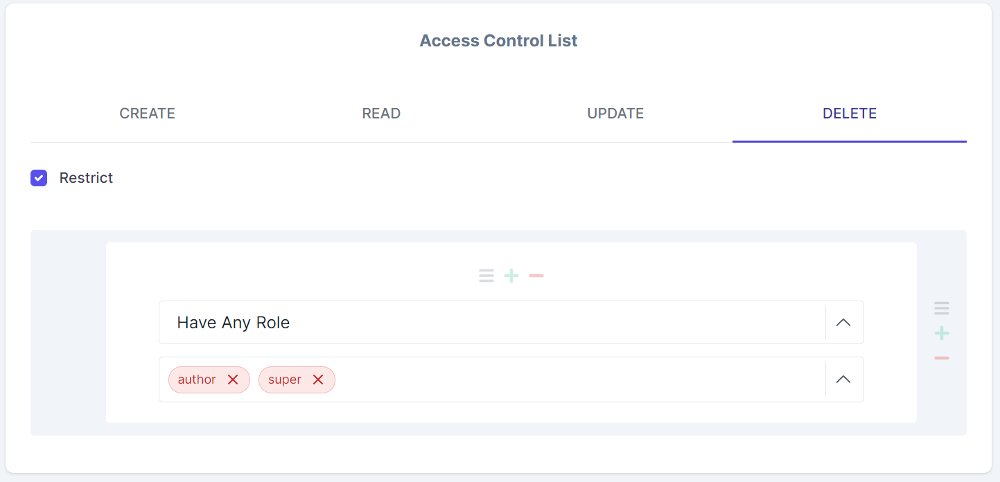

### Creating The Title Field

From the right sidebar click on the string button.

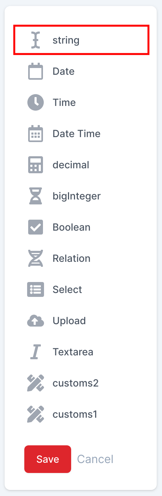

A string field will be created, put `Title` in the _Field Label_, and `title` in the _Field Name(in database)_ and mark the field as required.

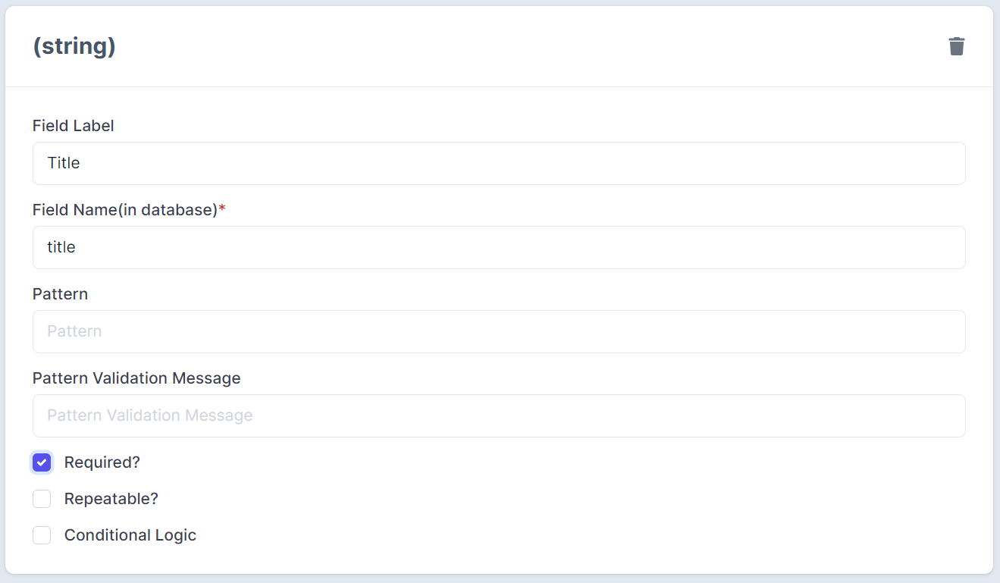

### Creating The Body Field

From the right sidebar click on _Textarea_, a new field will be created, put `Body` in the _Field Label_, and `body` in the _Field Name(in database)_ and select _WYSIWYG_ from the dropdown.

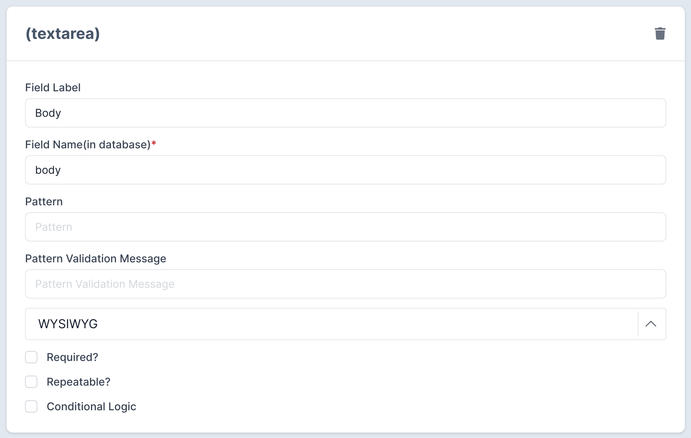

### Featured Image Field

Click on the _Upload_ button and put `Featured Image` in the _Field Label_ and `featuredImage` in the _Field Name(in database)_.

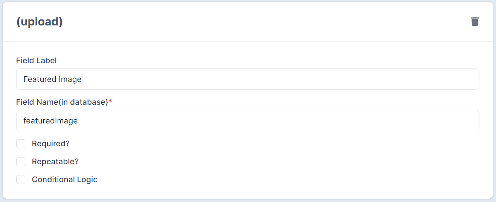

## Save The Schema

Click on the **Save** button on the right sidebar.

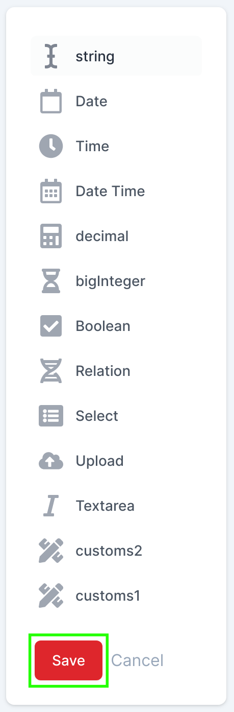

## Creating Post Content(the posts themselves!)

After creating the post schema it is the time to create some posts, after clicking the **Save** button a new item should be added to the sidebar.

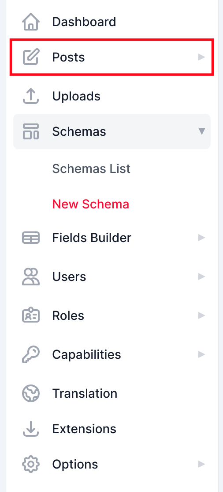

> If the new content didn't appear just refresh the page.

Click on the _Posts_ icon then click on _Add Post_.

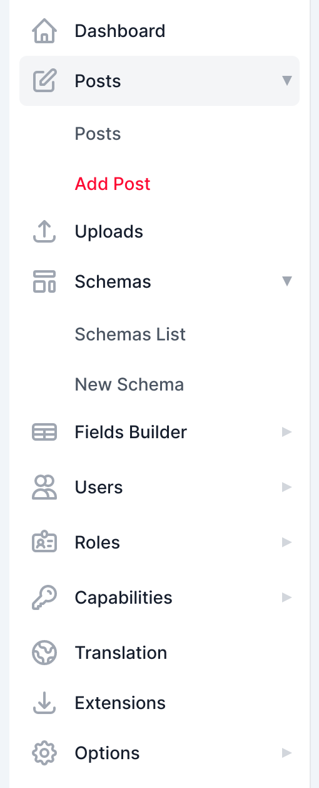

Fill the form fields with some data and click on the _Save_ button.

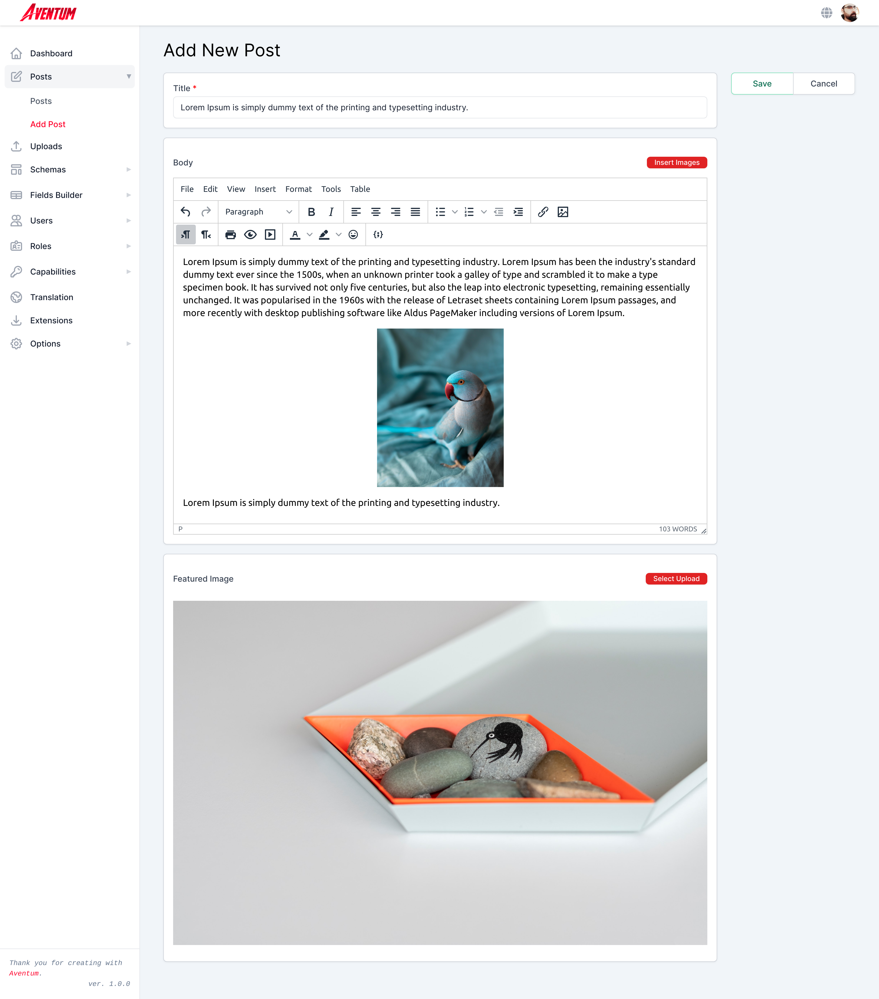

That is it! if you now click on the _Posts_ on the left sidebar you will see your post there.

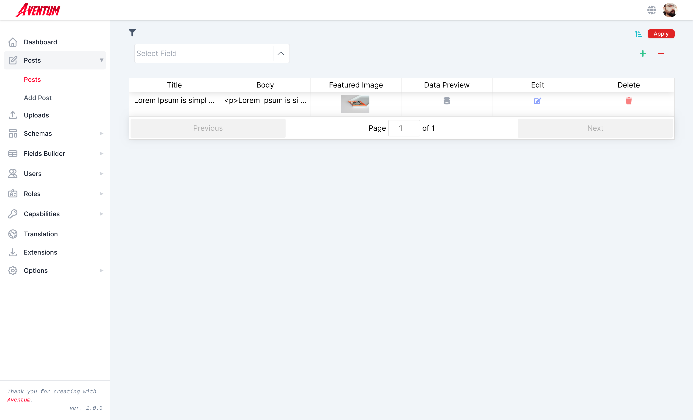

## List Post On Frontend

All what you have to do is make a GET request to [http://localhost:3030/posts](http://localhost:3030/posts) and the result will be:

```json
{
  "contents": [
    {
      "id": 1,
      "title": "Lorem Ipsum is simply dummy text of the printing and typesetting industry.",
      "body": "<p>Lorem Ipsum is simply dummy text of the printing and typesetting industry. Lorem Ipsum has been the industry's standard dummy text ever since the 1500s, when an unknown printer took a galley of type and scrambled it to make a type specimen book. It has survived not only five centuries, but also the leap into electronic typesetting, remaining essentially unchanged. It was popularised in the 1960s with the release of Letraset sheets containing Lorem Ipsum passages, and more recently with desktop publishing software like Aldus PageMaker including versions of Lorem Ipsum.</p>\n<p></p>\n<p>Lorem Ipsum is simply dummy text of the printing and typesetting industry.</p>",
      "status": "publish",
      "trash": false,
      "createdBy": "1",
      "updatedBy": null,
      "createdAt": "2020-10-06T21:39:14.547Z",
      "updatedAt": "2020-10-06T21:39:14.547Z",
      "featuredImage": 12
    }
  ],
  "pagination": {
    "totalPages": 1,
    "perPage": 20,
    "totalCount": 1
  }
}
```

To retrieve a single post make a GET request to `http://localhost:3030/posts/:id` for example to retrieve our single post make a GET request to(you post id should be different from ours) [http://localhost:3030/posts/1](http://localhost:3030/posts/1) and the result will be:

```json
{
  "content": {
    "id": 1,
    "title": "Lorem Ipsum is simply dummy text of the printing and typesetting industry.",
    "body": "<p>Lorem Ipsum is simply dummy text of the printing and typesetting industry. Lorem Ipsum has been the industry's standard dummy text ever since the 1500s, when an unknown printer took a galley of type and scrambled it to make a type specimen book. It has survived not only five centuries, but also the leap into electronic typesetting, remaining essentially unchanged. It was popularised in the 1960s with the release of Letraset sheets containing Lorem Ipsum passages, and more recently with desktop publishing software like Aldus PageMaker including versions of Lorem Ipsum.</p>\n<p></p>\n<p>Lorem Ipsum is simply dummy text of the printing and typesetting industry.</p>",
    "status": "publish",
    "trash": false,
    "createdBy": "1",
    "updatedBy": null,
    "createdAt": "2020-10-06T21:39:14.547Z",
    "updatedAt": "2020-10-06T21:39:14.547Z",
    "featuredImage": 12
  }
}
```
