We are going to create some categories, tags, and many posts(to make the pagination process for the frontend) entries, we will not create any comment, because we will create the comments from the frontend.

## Create Tags Entries

Navigate to [http://localhost:3333/contents/tags/new](http://localhost:3333/contents/tags/new) to create the tags entries.

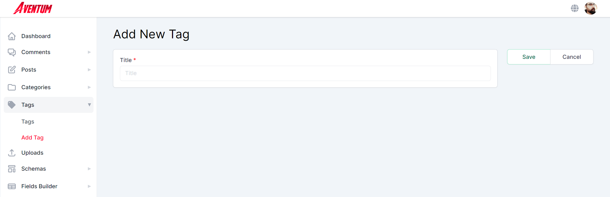

Enter `Tag1` in the _Title_ field and hit save.

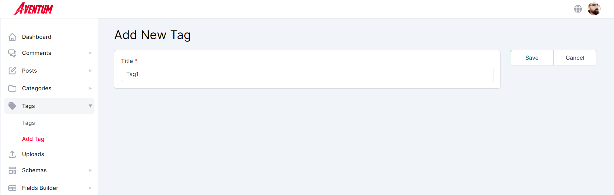

Repeat the process and create two other tags, `Tag2` and `Tag3`. now if you navigated to [http://localhost:3333/contents/tags/list](http://localhost:3333/contents/tags/list) the tags list should look like.

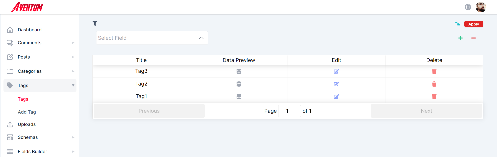

## Create Categories Entries

Navigate to [http://localhost:3333/contents/categories/new](http://localhost:3333/contents/categories/new) to create the categories entries.

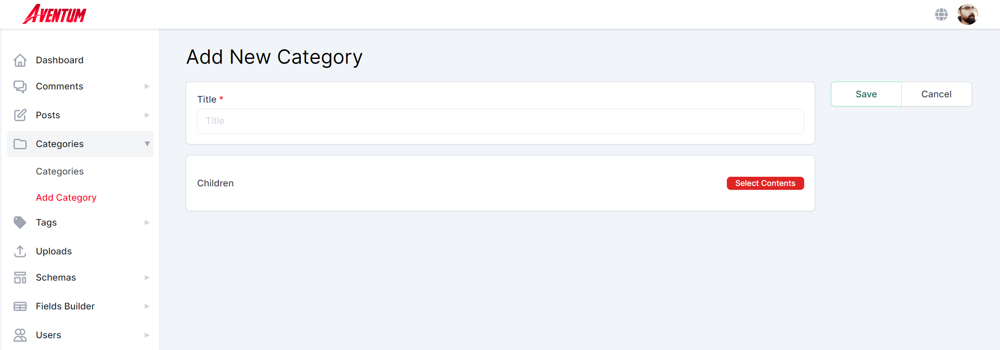

Enter `Category1` in the _Title_ field and hit save.

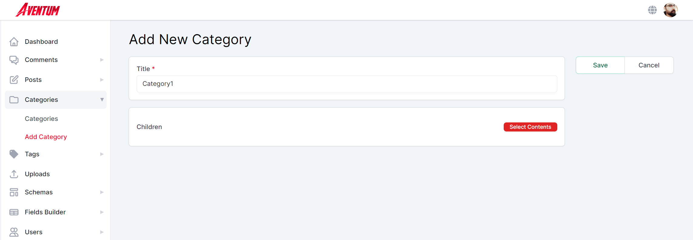

Repeat the process to create `Category2`, then create a third category `Category3` and this time click on _Select Content_ button in the _Children_ field and select `Category1` and `Category2` and hit _Done_.

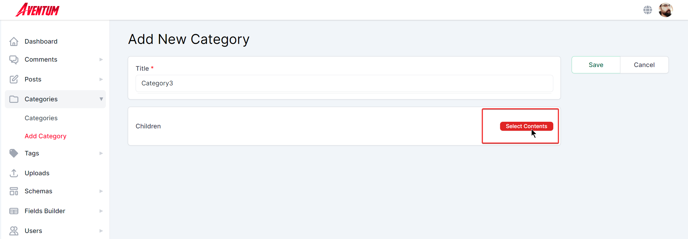

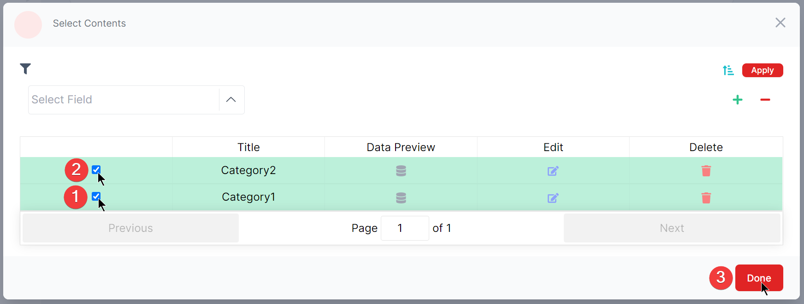

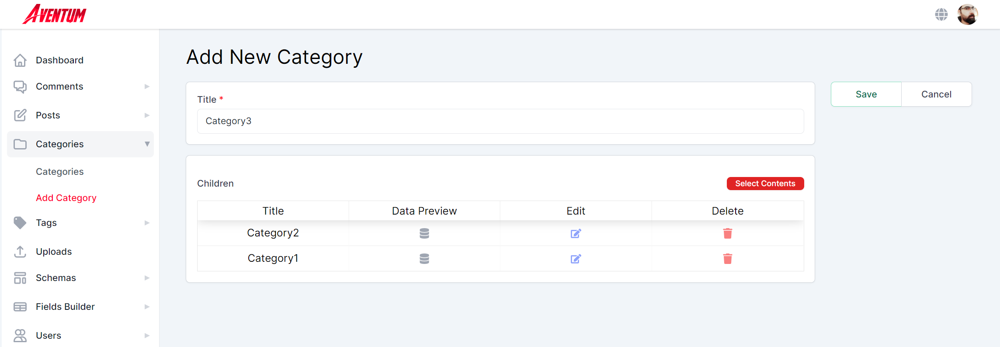

Click on the _Save_ button.

Now if you navigated to [http://localhost:3333/contents/categories/list](http://localhost:3333/contents/categories/list) the categories list should look like.

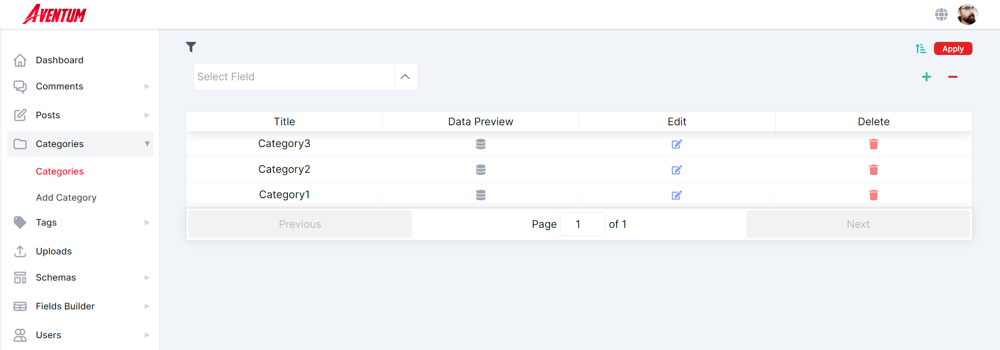

## Create Posts Entries

Navigate to [http://localhost:3333/contents/posts/new](http://localhost:3333/contents/posts/new) to create the posts entries, together we are going to create one post, however, I'll create about 100 posts programmatically in order implement the pagination process at the frontend, feel free to create as many posts as you like.

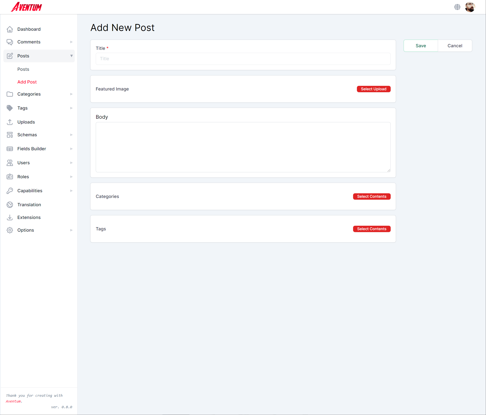

Enter some text in the _Title_ and _Body_ fields and select a featured image and random categories and tags and hit _Save_.

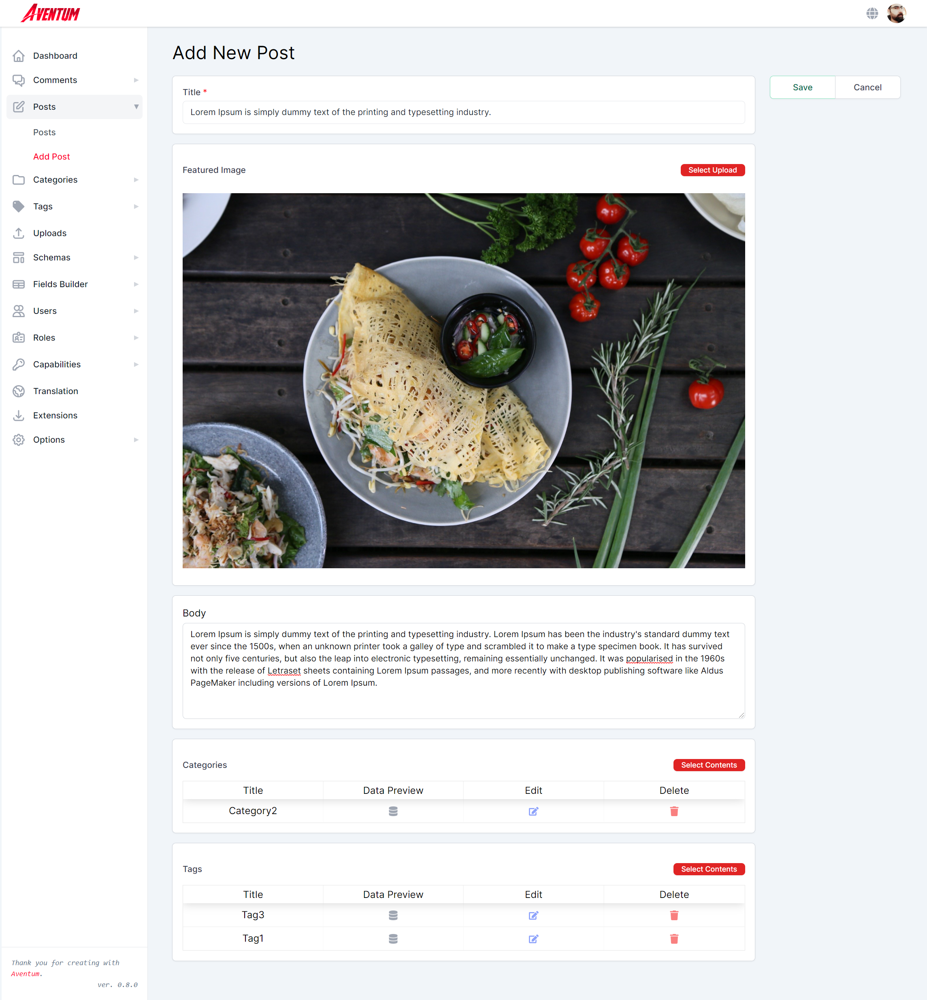

After creating some posts the posts list should look something like:

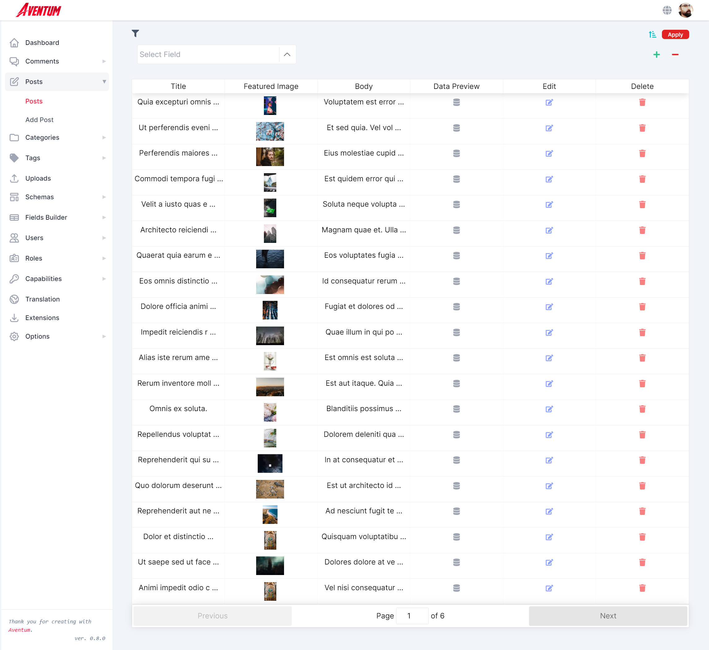
