We are going to create four contents, posts, comments, categories, and tags, so we need four schemas.

## Tags Schema

The first schema we are going to create is `Tags` schema navigate to [http://localhost:3333/schemas/new](http://localhost:3333/schemas/new) and in the schema title enter `Tags` in _Content Plural Title_ and `Tag` in _Content Singular Title_ and `tags` in _Content Plural Name_ and in _SVG Icon_ we will put the tag icon from [Heroicons](https://github.com/tailwindlabs/heroicons):

```html
<svg xmlns="http://www.w3.org/2000/svg" viewBox="0 0 20 20" fill="currentColor">
  <path
    fill-rule="evenodd"
    d="M17.707 9.293a1 1 0 010 1.414l-7 7a1 1 0 01-1.414 0l-7-7A.997.997 0 012 10V5a3 3 0 013-3h5c.256 0 .512.098.707.293l7 7zM5 6a1 1 0 100-2 1 1 0 000 2z"
    clip-rule="evenodd"
  />
</svg>
```

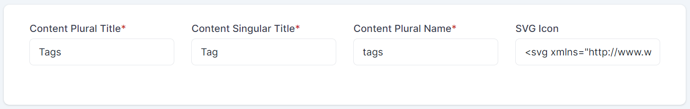

Next check the _Restrict_ option and select `Have Any Role` in the condition type dropdown and select `author` and `super` roles in the condition value dropdown for the _CREATE_, _UPDATE_, and _DELETE_ tabs of the _Access Control List_ section, this will restrict the _CREATE_, _UPDATE_, and _DELETE_ operations for the users that have `author` or `super` roles.

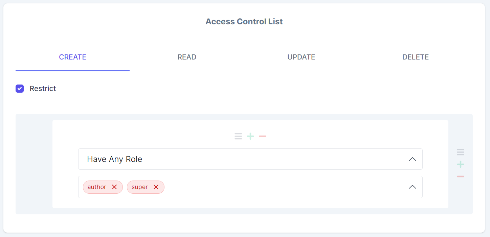
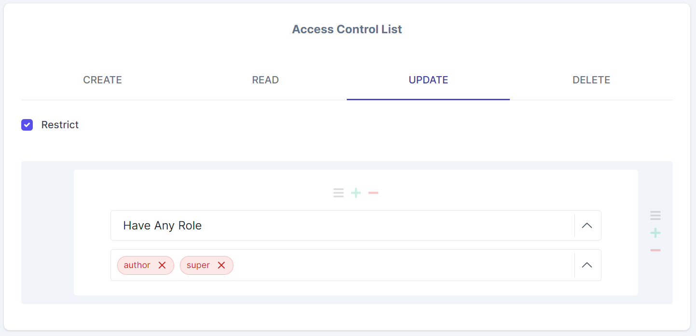
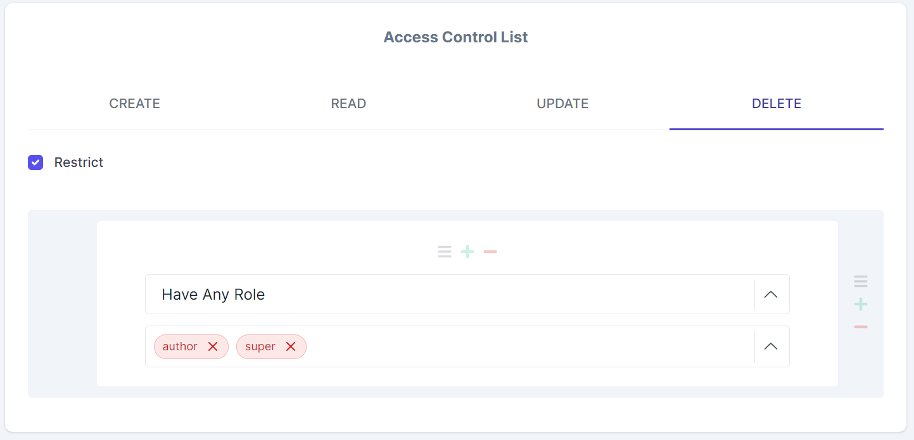

Our `Tags` schema will have only one `string` field, so create a `string` field and put `Title` in _Field Label_ and `title` in _Field Name(in database)_ and mark the field as required.

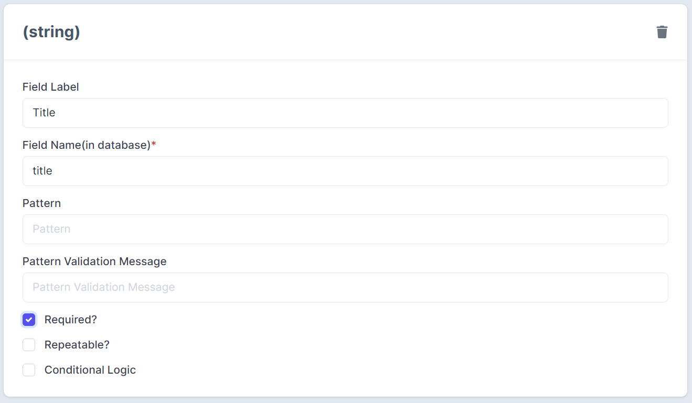

The full schema should look like:

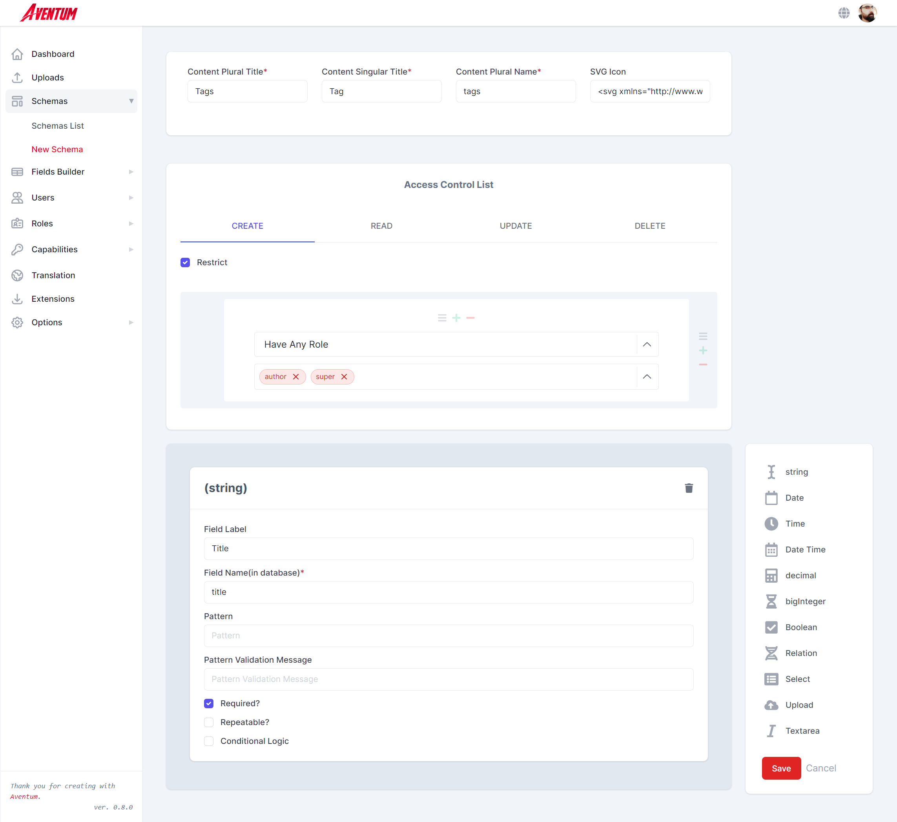

Click on the _Save_ button to save the schema.

## Categories Schema

Navigate to [http://localhost:3333/schemas/new](http://localhost:3333/schemas/new) and in the schema title enter `Categories` in _Content Plural Title_ and `Category` in _Content Singular Title_ and `categories` in _Content Plural Name_ and in _SVG Icon_ we will put the folder icon from [Heroicons](https://github.com/tailwindlabs/heroicons):

```html
<svg
  xmlns="http://www.w3.org/2000/svg"
  fill="none"
  viewBox="0 0 24 24"
  stroke="currentColor"
>
  <path
    stroke-linecap="round"
    stroke-linejoin="round"
    stroke-width="2"
    d="M3 7v10a2 2 0 002 2h14a2 2 0 002-2V9a2 2 0 00-2-2h-6l-2-2H5a2 2 0 00-2 2z"
  />
</svg>
```

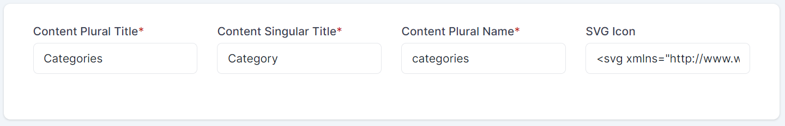

Next check the _Restrict_ option and select `Have Any Role` in the condition type dropdown and select `author` and `super` roles in the condition value dropdown for the _CREATE_, _UPDATE_, and _DELETE_ tabs of the _Access Control List_ section, this will restrict the _CREATE_, _UPDATE_, and _DELETE_ operations for the users that have `author` or `super` roles.


Our `Categories` schema will have two fields, `string` and `Relation` fields, we will create only the string field now then we will update the `categories` schema and create the `Relation` field, we want each category to have optional relation with itself! we want the ability for each category to have child categories and we can't create a relation for not existing schema, now create a `string` field and put `Title` in _Field Label_ and `title` in _Field Name(in database)_ and mark the field as required.

> More info about what is the Relation field and how its woks you can read [here](../../../docs/deep-dive/schema/).


The full schema should look like:

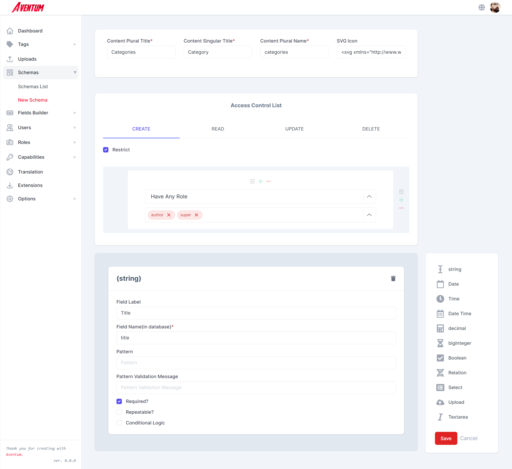

Click on the _Save_ button to save the schema.

Next click on the _Schemas List_ then on the _edit icon_ that belongs to the categories row.

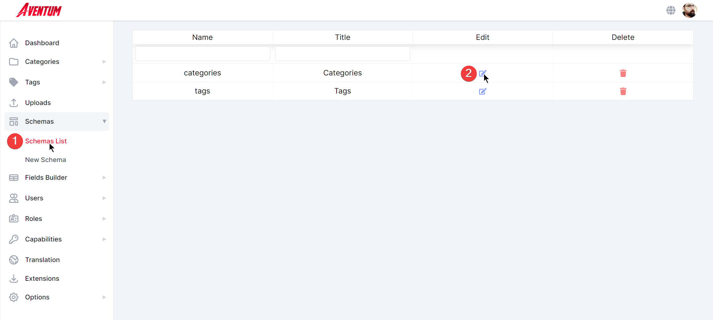

Now add the `Relation` field and enter `Children` in the _Field Label_ and `children` in the _Field Name(in database)_ and select `Categories` from the dropdown menu and check the _repeatable_ option. The repeatable option will allow each category to have as many children as it wants.

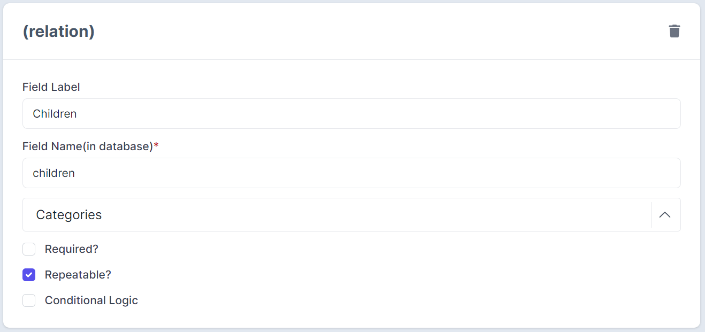

Click on _Update_, the whole schema should look like:

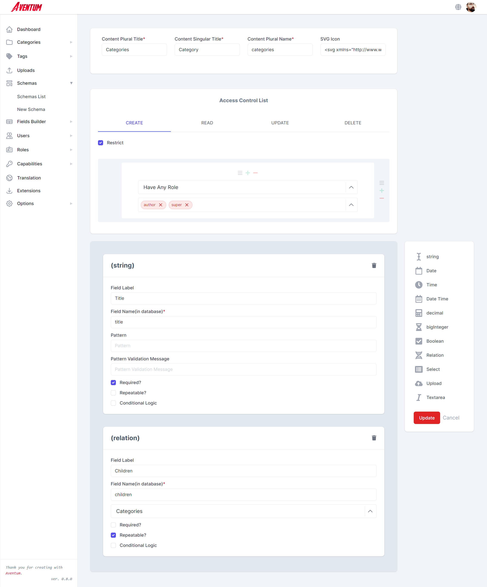

## Posts Schema

Our post schema will have five fields, title, featured image, body, categories, and tags. Navigate to [http://localhost:3333/schemas/new](http://localhost:3333/schemas/new) and in the schema title enter `Posts` in _Content Plural Title_ and `Post` in _Content Singular Title_ and `posts` in _Content Plural Name_ and in _SVG Icon_ we will put the pencil-alt icon from [Heroicons](https://github.com/tailwindlabs/heroicons):

```html
<svg
  xmlns="http://www.w3.org/2000/svg"
  fill="none"
  viewBox="0 0 24 24"
  stroke="currentColor"
>
  <path
    stroke-linecap="round"
    stroke-linejoin="round"
    stroke-width="2"
    d="M11 5H6a2 2 0 00-2 2v11a2 2 0 002 2h11a2 2 0 002-2v-5m-1.414-9.414a2 2 0 112.828 2.828L11.828 15H9v-2.828l8.586-8.586z"
  />
</svg>
```


Next check the _Restrict_ option and select `Have Any Role` in the condition type dropdown and select `author` and `super` roles in the condition value dropdown for the _CREATE_, _UPDATE_, and _DELETE_ tabs of the _Access Control List_ section, this will restrict the _CREATE_, _UPDATE_, and _DELETE_ operations for the users that have `author` or `super` roles.


Next, create a `string` field and put `Title` in _Field Label_ and `title` in _Field Name(in database)_ and mark the field as required.


Next, create the featured image field, create the `Upload` field and put `Featured Image` in _Field Label_ and `featuredImage` in _Field Name(in database)_.

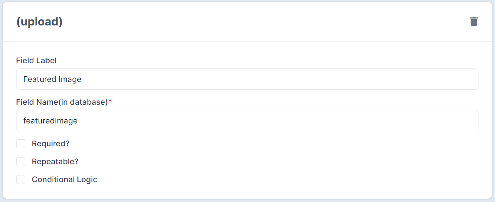

Create a `Textarea` field and enter `Body` in _Field Label_ and `body` in _Field Name(in database)_.

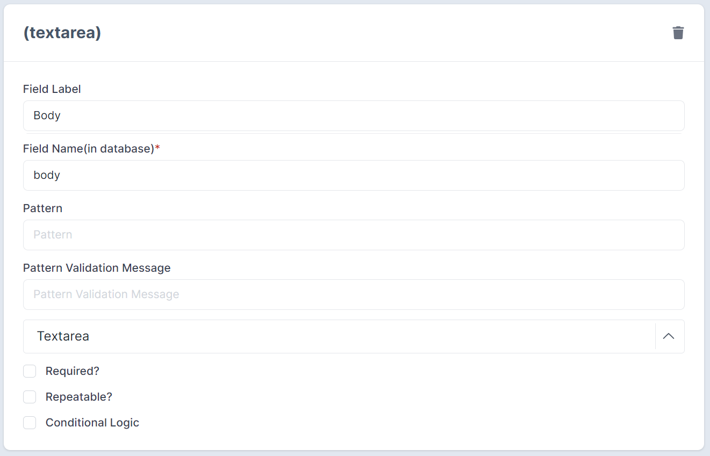

Now let's create the categories field, select the `Relation` field and enter `Categories` in _Field Label_ and `categories` in _Field Name(in database)_ and select `Categories` from the dropdown list as the schema that we want to create a relation with finally check the _Repeatable?_ checkbox to be able to have one post in multiple categories.

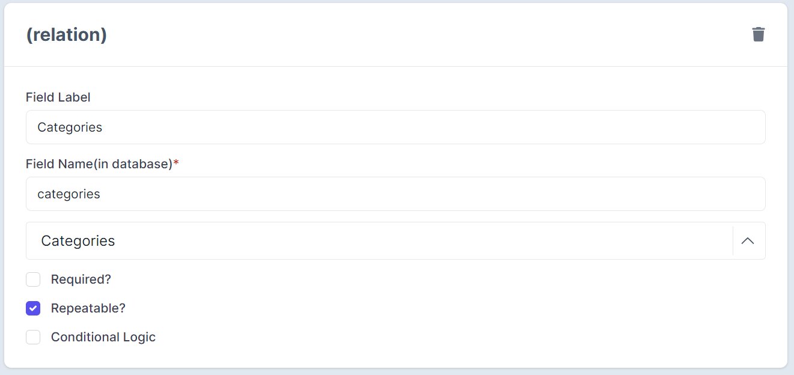

Finally, the `Tags` relation, will look exactly like the `Categories` above so add the `Relation` field, the title will be `Tags` and the name will be `tags` and select `Tags` from the dropdown list and check the _Repeatable?_ checkbox.

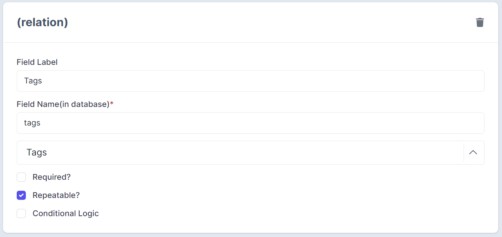

The full schema should look like:

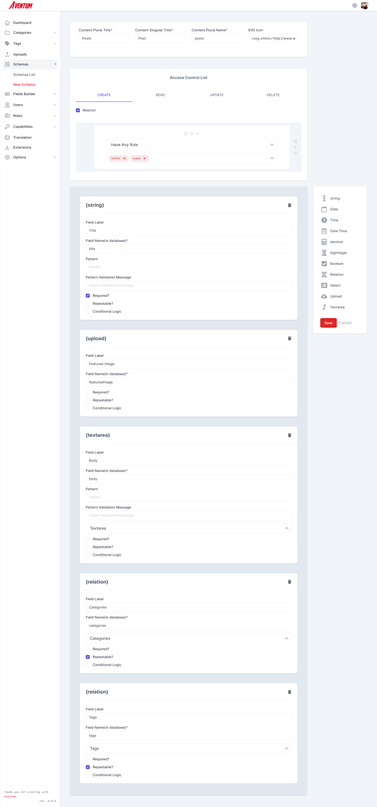

Click on the _Save_ button to save the schema.

## Comments Schema

The final schema we are going to create is `Comments` schema navigate to [http://localhost:3333/schemas/new](http://localhost:3333/schemas/new) and in the schema title enter `Comments` in _Content Plural Title_ and `Comment` in _Content Singular Title_ and `comments` in _Content Plural Name_ and in _SVG Icon_ we will put the chat-alt-2 icon from [Heroicons](https://github.com/tailwindlabs/heroicons):

```html
<svg
  xmlns="http://www.w3.org/2000/svg"
  fill="none"
  viewBox="0 0 24 24"
  stroke="currentColor"
>
  <path
    stroke-linecap="round"
    stroke-linejoin="round"
    stroke-width="2"
    d="M17 8h2a2 2 0 012 2v6a2 2 0 01-2 2h-2v4l-4-4H9a1.994 1.994 0 01-1.414-.586m0 0L11 14h4a2 2 0 002-2V6a2 2 0 00-2-2H5a2 2 0 00-2 2v6a2 2 0 002 2h2v4l.586-.586z"
  />
</svg>
```

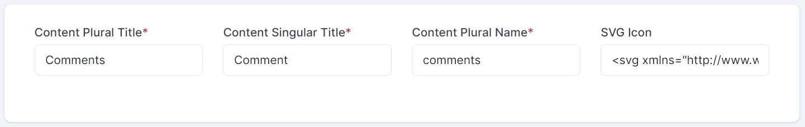

Now for the _Access Control List_ section check the _Restrict_ option and select `Authenticate` in the condition type dropdown for the _CREATE_ tab.

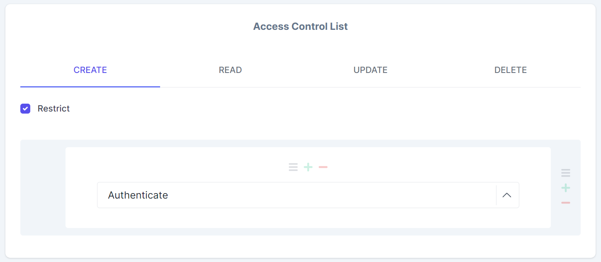

That means any authenticated user(logged-in user) can create comments.

For the _UPDATE_ and _DELETE_ tabs check the _Restrict_ option and select `Owner` and click on the plus icon above the `Owner` a new condition should be created select `Operator` from the condition type dropdown and select `OR` as value, click the plus button above `Operator` and for the new condition select `Have Any Role` in the condition type dropdown and select `author` and `super` roles in the condition value dropdown.

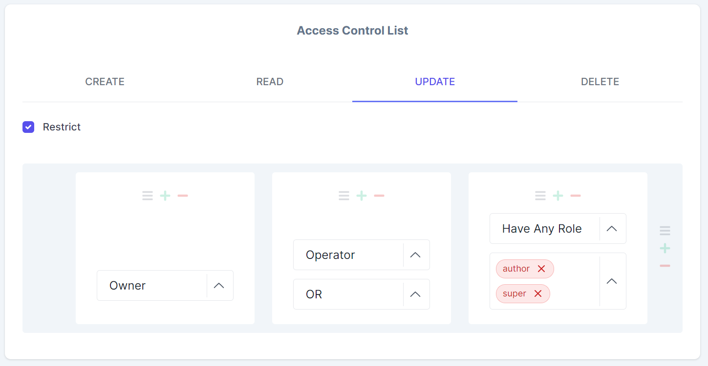
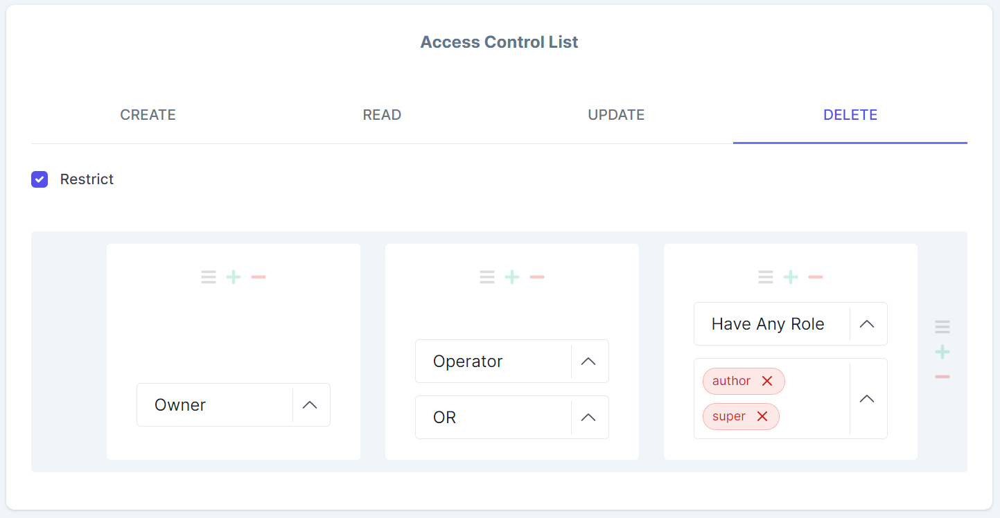

That means the comment's owner will be able to update and delete her/his comment also if the user has an author or super role will be able to do so as well.

Next, create the comment subject by creating a `string` field and put `Subject` in _Field Label_ and `subject` in _Field Name(in database)_ and mark the field as required.

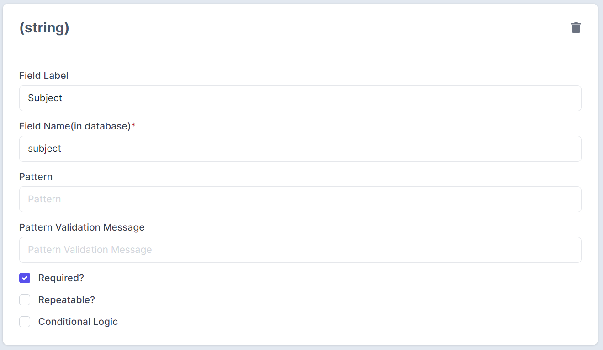

Create a `Textarea` field and enter `Body` in _Field Label_ and `body` in _Field Name(in database)_.


Finally create a Relation field and enter `Post` in _Field Label_ and `post` in _Field Name(in database)_ and select `Posts`, in the relation dropdown menu, this means each comment should be attached to one post, mark the field as required.

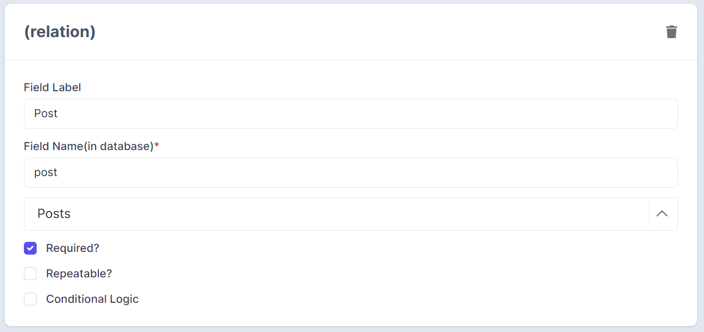

The full schema should look like:

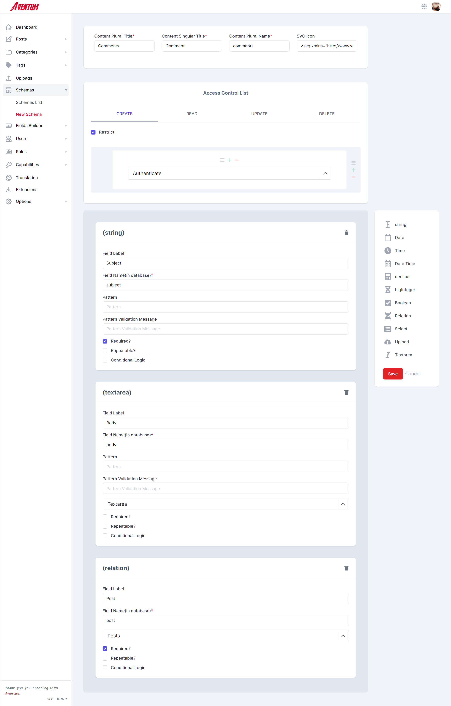

Click on the _Save_ button to save the schema.
