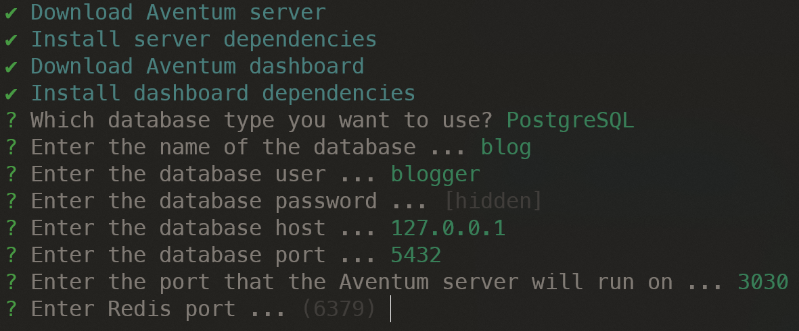

## Redis

Make sure you have [Redis](https://redis.io/) up and running.

## Database

We will use [PostgreSQL](https://www.postgresql.org/) for our example, however, feel free to use any other database [supported by Aventum](/docs/getting-started/#supported-databases), in our example the database name is `blog` and the database user called `blogger` and the password is `000000`

## Node.js

Make sure you have [Node.js](https://nodejs.org/)(LTS version is recommended) installed on your system.

## Aventum CLI

We will install Aventum using the CLI because it is the easiest way.

Install the CLI first by running `npm install @aventum/cli -g` then create a new folder and name it `blog` and in this folder run `aventum create --run` Aventum CLI will setup everything for you and will ask you a few questions.

First, it will ask you about which type of database you want to use, in our case we will select `PostgreSQL`.

Next, it will ask you about your database name, our database name is `blog`.

After that it will ask us to enter the database user, we will type `blogger`.

Then it will ask up to enter the database password, we will type `000000`

Next enter the database host, the default value is good for us so just hit enter.

The next question about the database port and we will enter `5432`.

Next, it will ask us about Aventum server port, again we will leave the default value so just hit enter.

Next enter the Redis port, hit enter to pick the default value.

Next enter Redis host, the default value is good for us so we will hit enter.

Then enter Redis DB, we will hit enter to accept the default value.

Next, enter Redis password, we don't have a password so we will just hit enter.

Next question about the Redis family we will choose the default answer by hitting enter.

After that Aventum CLI will complete the installation and if everything goes right you will see the following:

As the CLI suggests you should navigate to [http://localhost:3333/setup](http://localhost:3333/setup) to create your superuser.

> After running Aventum to stop it just type CTRL+C and to run it again run `aventum run` in the blog folder.

## Blog Settings

Since we want the users to be able to register on our website lets enable the registration, navigate to [http://localhost:3333/options/general](http://localhost:3333/options/general) and check the `Enable Registration` checkbox and hit _Save_.

Also, we are going to implement features(like the forget password feature) that need email configuration, so please navigate to [http://localhost:3333/options/email](http://localhost:3333/options/email) and enter your email SMTP settings.

Now that we have Aventum up and running let's create some content with it!
